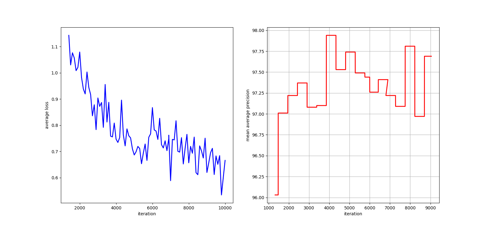

# YoloV4 Hand Detector

Pre-trained Hand Detector based-on YOLOv4 architecture.

## Description

There are already existing pre-trained hand detector on the internet. Most of them based on MobileNetSSD networks and some
of them are based on YOLO architecture. However, the majority (YOLO-based) are not available with proper documentation, making it hard to fine-tune/transfer-learning.

The goals of this project are:
- To offer stable hand detector.
- To give others the ability to fine-tune/ a pre-trained and hopefully save them effort and time :)

## Dataset

Yolov4 was trained on custom [EgoHands](http://vision.soic.indiana.edu/projects/egohands/) dataset mainly.

EgoHands is basically meant for detecting complex egocentric hands interactions, i.e each interaction is a class.

My goal is to detect the hand as an object from egocentric/pseudo-egocentric point-of-view.

An annotated version of Egohand dataset is available for 4 activity detection [Roboflow EgoHands](https://public.roboflow.com/object-detection/hands/1)
For the task of hand/no-hand, a modification of the annotation files was required. Instead of having 4 class, only one is needed for all hand instances across all images.
The training set consists of 90% of the total images number.

### Training

In order to train YOLOv4, the [DarkNet](https://github.com/AlexeyAB/darknet) by Alexey Bochkovskiy was built and the
instructions as specified in the docs were followed.

Information about the training parameters you can find in the custom-yolov4 configuration file under the models directory.

The model was trained for until there was no significant change in the average loss value (ca. 12k iterations).

## License

This project is licensed under the [MIT License] License - see the LICENSE.md file for details

## Acknowledgments

Inspiration, code snippets, etc.
* [cansik/yolo-hand-detection](https://github.com/cansik/yolo-hand-detection)
* [Handtracking](https://github.com/victordibia/handtracking)
